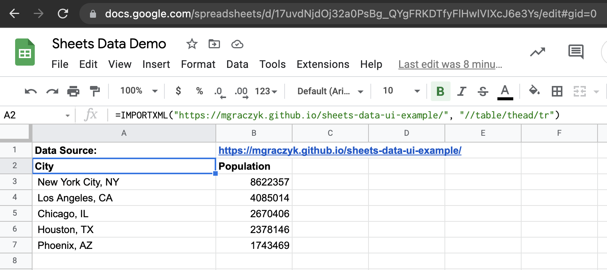

# Google Sheets Data Example

This is a demo showing how to use Google Sheets to display tabular data from an
HTTP API.

The data in index.html is rendered in
[this Google Sheet](https://docs.google.com/spreadsheets/d/17uvdNjdOj32a0PsBg_QYgFRKDTfyFlHwlVIXcJ6e3Ys/edit?usp=sharing)
using `IMPORTXML`

